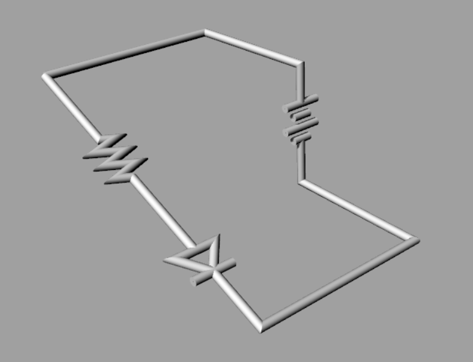

# 回路について

電気は電源から出発し、色々な経路やパーツを通って、再び電源へと返ってきます。
このように通り道が一巡しないと、電気は流れないためこの通り道の事を回路と言います。

とはいえ電気は**目に見えません。**なので、どう動いているのか想像しにくいです。
よく言われるのが、電気を**水**、回路を**水路**に例える方法です。

この場合、**電圧は水路の高さ**、**電流は水の勢い**に例えられます。

(電源は、下まで落ちた水を再度上まで組み上げるポンプと言えるかもしれません。)

### 電気を例える！

と、理科の授業で習った人は多いと思います。
でも、それだけじゃ実感わかないですよね。
そこで、電気を自分にとってイメージしやすい、目に見えるもの、実感の湧くものに例えてみましょう。

人によっては[スケートボード](http://avant.org/project/skating-the-circuits/)に例える人もいるし、

人体(血管)、地下鉄なんかに例える人もいます。

僕は個人的には、マーブルマシンに置き換えて想像するのがお気に入りです。

### 回路は立体？
スケートボードもマーブルマシンも、電圧を位置エネルギー、電流を運動エネルギーとして捉えていますね。

そう考えると回路図は、最初に見せたような平面的な物ではなく、もっと立体的に描いた方が分かりやすいのかもしれません。

