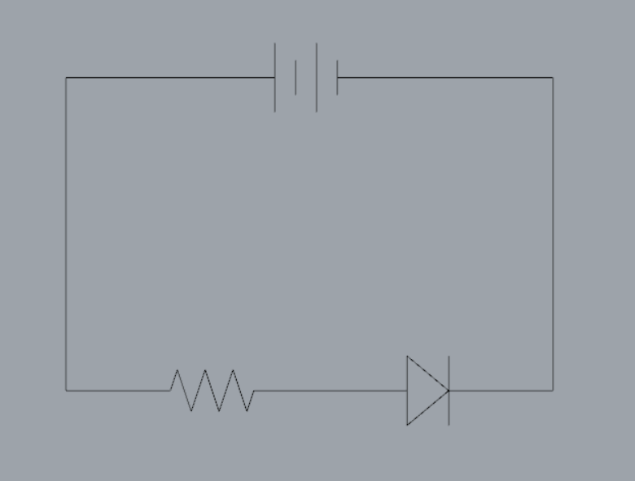

# **パーツ紹介**

Lチカ回路を作るためのパーツを見ていきましょう。

## ブレッドボードとジャンパワイヤー

↑**ブレッドボード**

電子工作というと、導線をはんだ付けするイメージが強いですが、今回はより手軽に回路を作るべくブレッドボードを使います。ブレッドボードに空いた穴の下には薄い鉄板が入っており、穴同士を以下の図のように繋いでくれています。

この穴に両端がむけた導線**ジャンパワイヤー**やパーツを差し込むことで回路を作っていきます。
たとえば **↓** の写真のように差し込んだ、赤と黄のジャンパワイヤーの両端は電気的に繋がっています

## 電池 ＝ Arduinoの電源ピン
今回はArduino（詳しくは[後のページ](./ct3-arduino.md)で）の電源ピンを電池代わりに使用します。ArduinoをUSBに繋ぐと

* **5V**ピンが電池でいうプラス極
* **GND**ピンピンが電池でいうマイナス極

として使えるようになります。

## 抵抗
LEDだけだと、電流が流れ過ぎて焼き切れてしまうので、抵抗をはさんで電流を弱めてあげます。
抵抗の大きさは、[カラフルなシマシマで計算する](https://www.jarl.org/Japanese/7_Technical/lib1/teikou.htm)ことができます。逆には[こちら](http://resisto.rs/)。

はさむ抵抗が大きければ大きいほど、LEDの光が弱くなりますが、熱が発生して焼き切れる心配がなくなります。
今回は、まず1kΩを使ってLチカしてみましょう。

## LED
LEDには、電気を流す方向があります。
見分け方にはいくつかあるのですが、一番わかりやすいのは**足の長さ**を見ること。

* 長い方の足が、電源のプラス側
* 短い方の足が、電源のマイナス側

につながります。

（別の見分け方として、[LEDの中の形を覗き込む方法](http://objects.avant.org/skating-the-circuits/led.png)もあります。）

## いざ、結線！
以上のパーツでさっきの回路図を置き換えると、

↓↓↓　こうなります　↓↓↓

