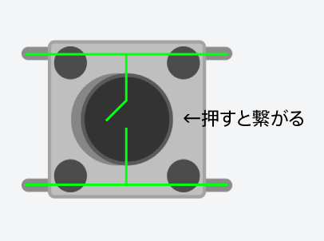
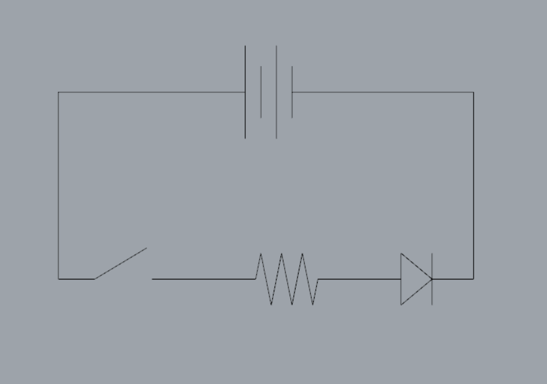
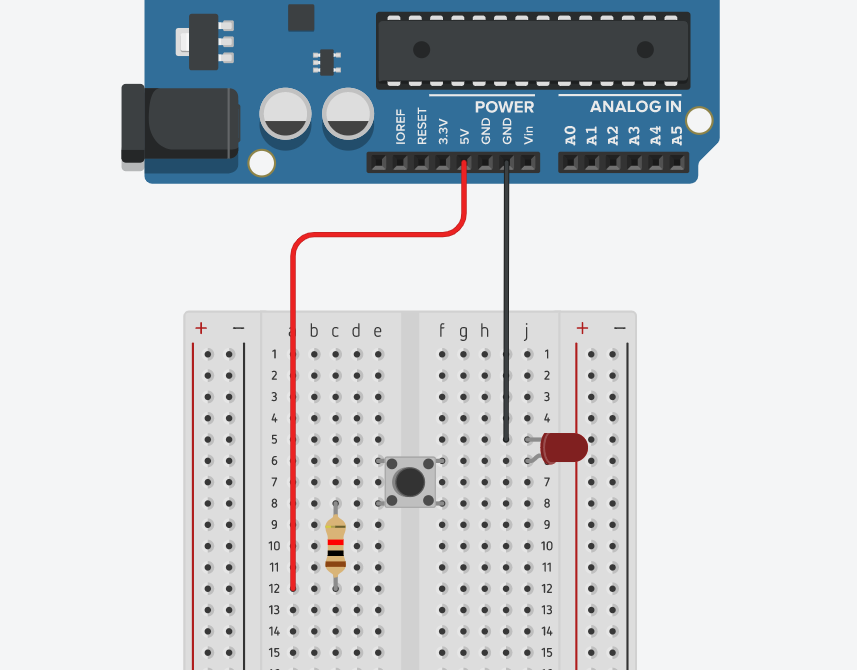
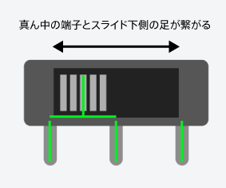
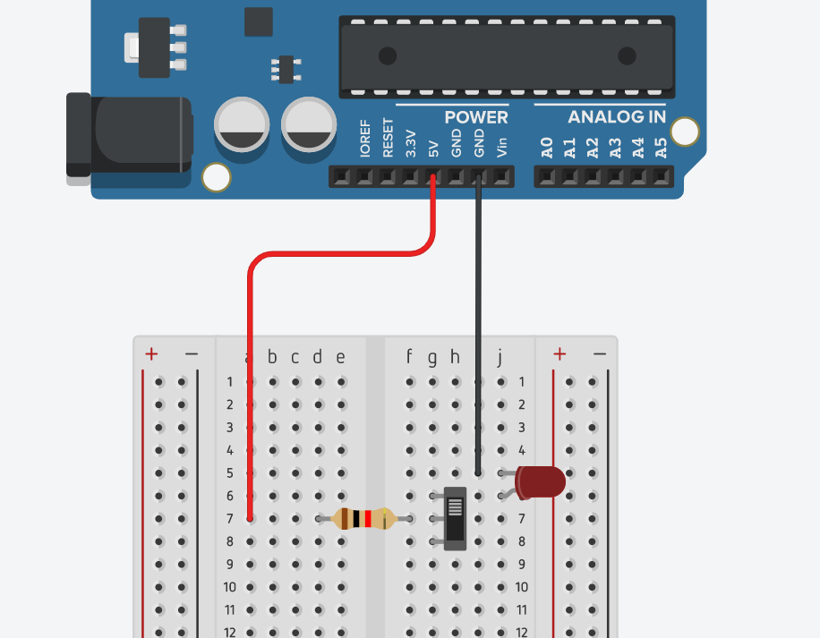

# スイッチ
LEDを光らせることができたら、スイッチをつなげて**ON / OFF**がコントロールできるようにしてみましょう。

## タクトスイッチ

タクトスイッチの内部は、押すと両端の足が繋がるようにできています。

回路図としてはこんな感じ、

これを、実際のパーツで繋げるとこうなります↓

## スライドスイッチ

スライドスイッチは、つまみをスライドしないと状態が変わりません。

これに付け替えると、**on/off**の状態を保持してくれます。

