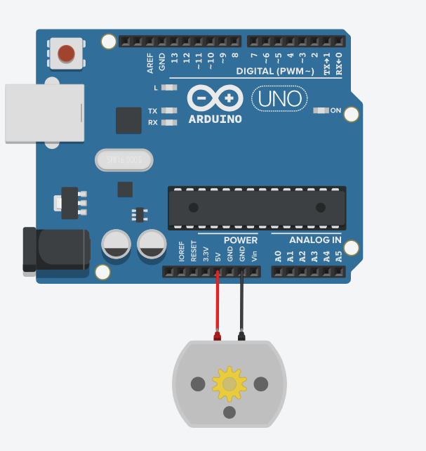

#モーター

LEDがコントロールできたので、これをモーターに入れ替えてみましょう。

LEDと違って頑丈なので、抵抗は外します。
あと、ブレッドボード経由ではなく、Arduinoに直つなぎしましょう。

こんな感じ　↓

今回使うモーターは **ギアモーター** といって、ミニ四駆等に使われている**DCモーター**にギアボックスをつけて、スピードは落ちるものの、トルクを上げたモノになります。

他に電子工作で良く見かけるモーターには、

* サーボモーター
* ステッピングモーター
* ブラシレスモーター

等があります。
