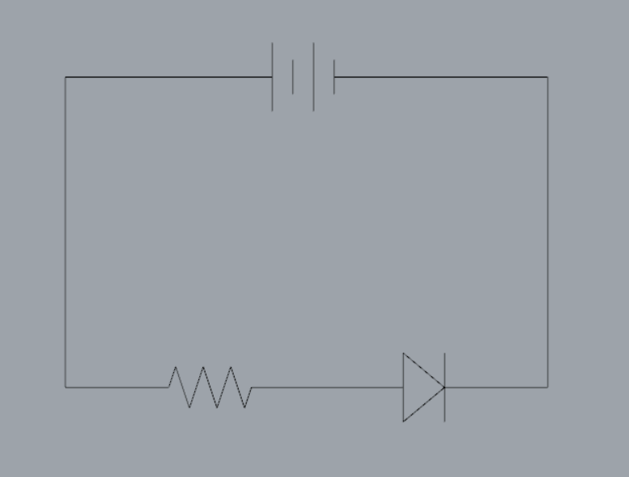
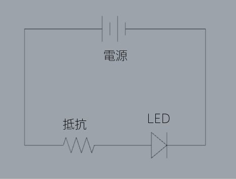

# Lチカしてみよう
**Lチカ = LEDチカチカ**は、LEDを点灯させる回路やテストの事ですが、単純なものからパーツ数が多く複雑なものまで方法が幅広くあり、電子工作の中でも良いスタートポイントです。

実は、最初に見せた回路図もLチカの一種でした。

回路図は、[回路記号](https://www.engineer314.com/senmon/ess.html)という回路を構成するパーツを簡略化したアイコンで表現されています。各記号の意味は以下の通りです↓

あとは、この図の通りに線で各パーツを繋いでいくのですが、その為のパーツや道具の使い方を学んでいきましょう。
