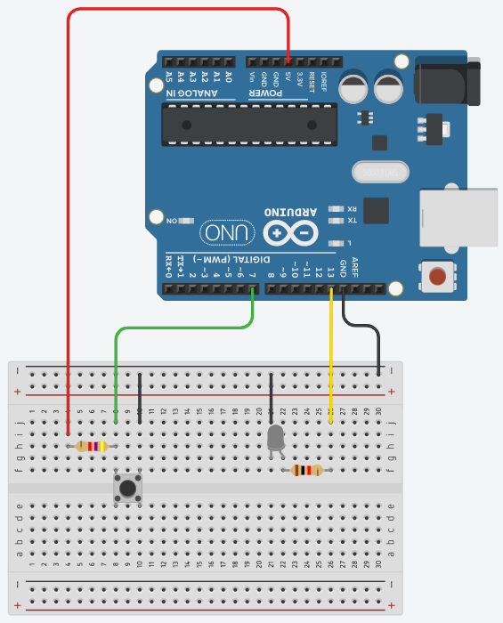

# **スイッチでの入力**

### 配線



### コード

```c++
void setup()
{
  pinMode(7, INPUT);
  pinMode(13, OUTPUT);
}

void loop()
{
  if(digitalRead(7)){
    digitalWrite(13,LOW);
  }else{
    digitalWrite(13,HIGH);
  }
}
```
