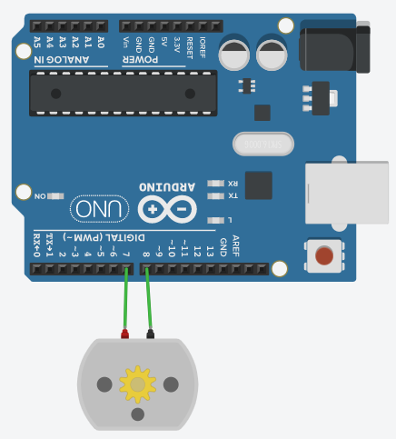

# モーターの逆転

### 配線



### コード

```c++
void setup()
{
  pinMode(7, OUTPUT);
  pinMode(8, OUTPUT);
}

void loop()
{
  digitalWrite(7, HIGH);
  digitalWrite(8, LOW);
  delay(3000); // Wait for 3000 millisecond(s)
  digitalWrite(7, LOW);
  digitalWrite(8, HIGH);
  delay(3000); // Wait for 3000 millisecond(s)
}
```
