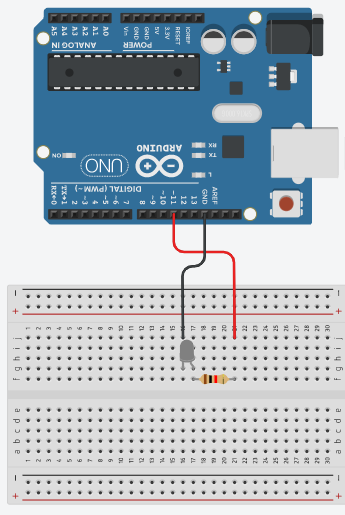

# **PWM（ピーダブリューエム）**

[参考](https://create.arduino.cc/projecthub/muhammad-aqib/arduino-pwm-tutorial-ae9d71)

### 配線


### コード
```c++
//Initializing LED Pin
int led_pin = 11;
void setup() {
  //Declaring LED pin as output
  pinMode(led_pin, OUTPUT);
}
void loop() {
  //Fading the LED
  for(int i=0; i<255; i++){
    analogWrite(led_pin, i);
    delay(5);
  }
  for(int i=255; i>0; i--){
    analogWrite(led_pin, i);
    delay(5);
  }
}
```
