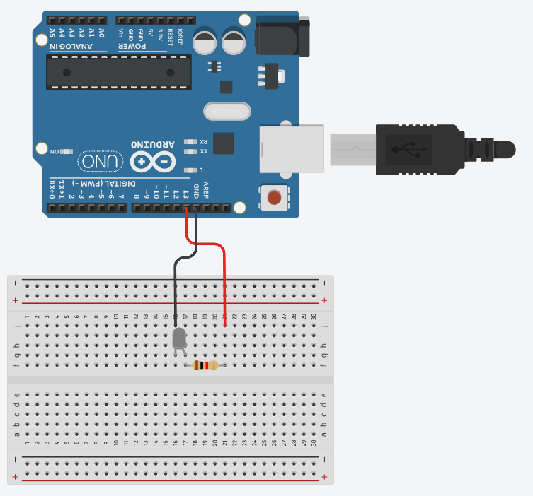

# **Arduino**

Arduino(アルドゥイーノ)は、デザイナーやアーティスト達の為に作られたマイコン（マイクロコントローラーの略）です。
プログラムを与えることで、各ピンの出力を切り替えれます。

ここからは、ArduinoでLEDやモーターをコントロールする方法に触れていきましょう。

## ダウンロード

まずは[公式サイトからArduino用のソフトをダウンロード](https://www.arduino.cc/en/Main/Software)してください。

## プログラムで制御
さっきまで、スイッチと手でやっていたLチカをArduinoにやらせてみましょう。

## その他のマイコン
* [micro:bit](https://archive.microbit.org/ja/)
教育用マイコンボード、コードを書くんじゃなくて、命令の詰まったブロックを積み重ねていくことでプログラムしていくのが特長。
最初から色んなセンサーを内蔵しており、Arduinoよりも高性能なチップを積んでいる意外とすごいやつ。

* [M5STACK](https://m5stack.com/)
液晶ディスプレイとwifiモジュールを標準搭載したIoT制作の強い味方。
インターネット経由で他のデバイスやサーバ、ウェブサイトと遠隔で連動するなんてことができちゃう。

* [Raspberry Pi](https://www.raspberrypi.org/)
手のひらに収まるパソコン。マイコンでは、重たくて処理できない画像処理、グラフィック生成等が可能。
いっちょ前にOS(Linux)で動く、"シングルボードコンピュータ"。
