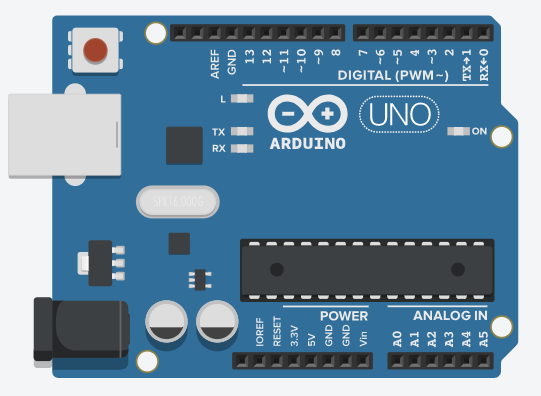

# Arduino

Arduino(アルドゥイーノ)は、デザイナーやアーティスト達の為に作られたマイコン（マイクロコントローラーの略）です。
プログラムを与えてやることで、各ピンの出力を切り替えれます。

ここからは、ArduinoでLEDやモーターをコントロールする方法に触れていきましょう。

## ダウンロード

まずは[公式サイトからArduino用のソフトをダウンロード](https://www.arduino.cc/en/Main/Software)してください。

## プログラムで制御
さっきまで、スイッチと手でやっていたLチカをArduinoにやらせてみましょう。

## その他のマイコン
* micro:bits
* m5 stack
* Raspberry Pi
